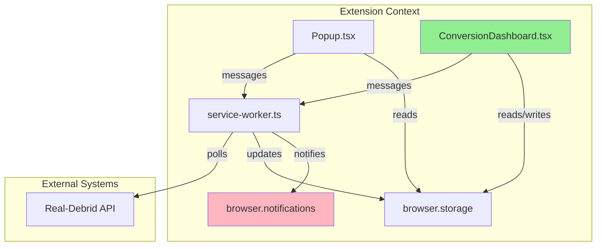
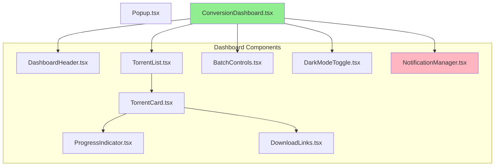
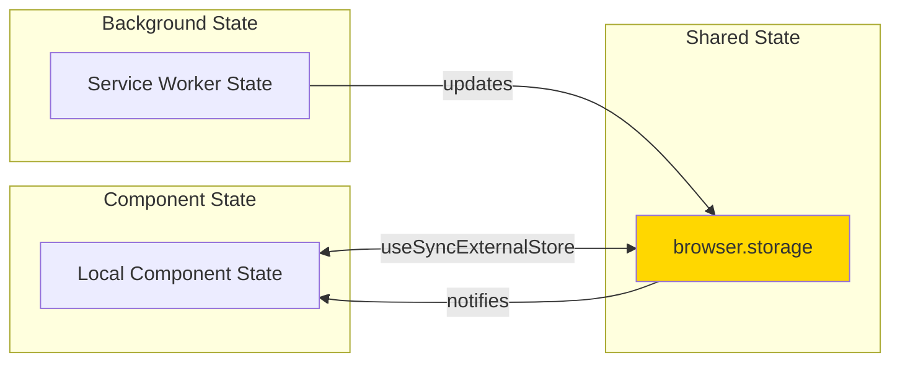
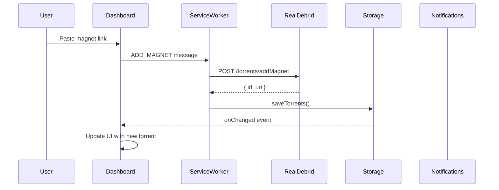
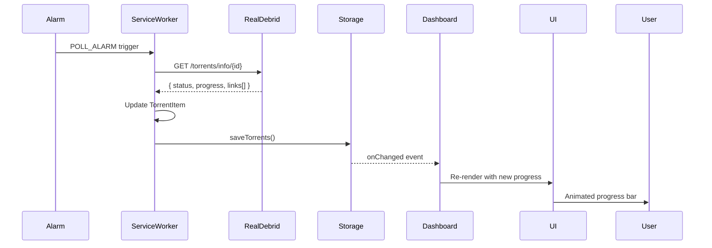
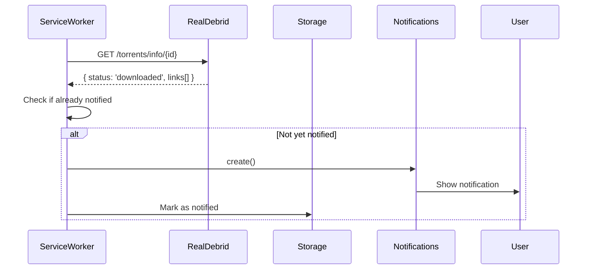
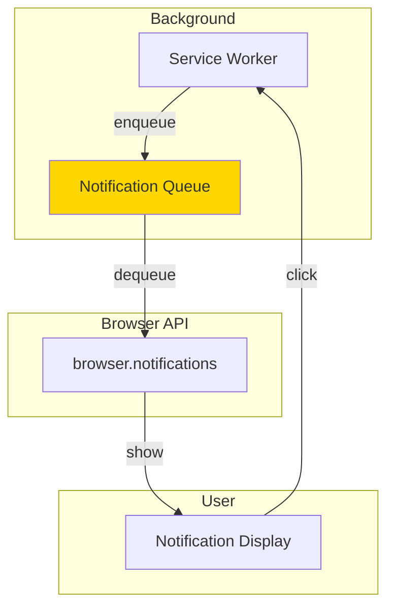
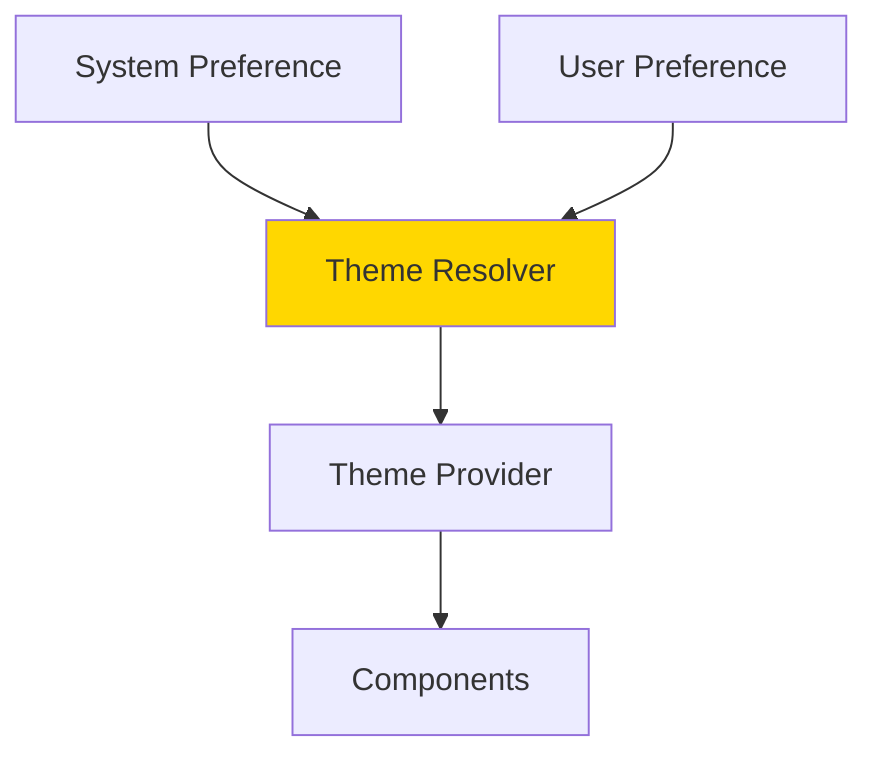

# Conversion Dashboard Architecture Design

**Feature**: Conversion Dashboard
**Date**: 2025-02-14
**Status**: Design Document
**Related Specs**: 001-real-debrid-magnet-handler

---

## Executive Summary

This document outlines the architecture for a comprehensive conversion dashboard that enhances the existing Real-Debrid Magnet Handler browser extension. The dashboard provides real-time progress visualization, OS-level notifications, downloadable link management, batch operations, and persistent dark mode support.

## Requirements Overview

### Functional Requirements

1. **Live Progress Visualization**: Animated, non-blocking progress indicator (0-100%) for each torrent
2. **OS-Level Notifications**: Browser notifications when background conversions complete
3. **Downloadable Links**: Individual clickable buttons for each link in the API's `links[]` array
4. **Batch Actions**: "Retry all failed" and "Clear completed" controls
5. **Dark Mode**: Persistent toggle respecting system preference with user override

### Non-Functional Requirements

- Non-blocking UI updates (progress updates shouldn't block user interactions)
- Production-ready, maintainable architecture
- Firefox/Chrome compatibility (Manifest V3)
- Efficient state management for real-time updates
- Minimal performance impact on existing functionality

---

## Architecture Overview

### System Context



### Design Principles

1. **Separation of Concerns**: Dashboard UI separate from popup UI
2. **Reactive State Management**: Use React hooks with storage sync
3. **Progressive Enhancement**: Enhance existing functionality without breaking changes
4. **Performance-First**: Efficient polling and rendering strategies
5. **Type Safety**: Leverage TypeScript for compile-time guarantees

---

## Component Architecture

### Component Hierarchy



### Component Responsibilities

#### ConversionDashboard.tsx (Main Container)
- **Purpose**: Root component orchestrating all dashboard functionality
- **Responsibilities**:
  - State management for torrents, settings, and UI state
  - Coordinate child components
  - Handle storage change listeners
  - Manage dark mode state
  - Initialize notification manager

#### DashboardHeader.tsx
- **Purpose**: Display dashboard title and summary statistics
- **Responsibilities**:
  - Show total torrents count
  - Show processing/ready/error counts
  - Display last update timestamp

#### TorrentList.tsx
- **Purpose**: Render list of torrent cards with filtering/sorting
- **Responsibilities**:
  - Filter torrents by status
  - Sort by added date or status
  - Handle empty states
  - Virtual scrolling for performance (if needed)

#### TorrentCard.tsx
- **Purpose**: Individual torrent display with progress and actions
- **Responsibilities**:
  - Display torrent metadata (filename, status, added date)
  - Show progress indicator for processing torrents
  - Render download links for ready torrents
  - Provide individual actions (retry, remove)
  - Handle status-specific UI variations

#### ProgressIndicator.tsx
- **Purpose**: Animated, non-blocking progress visualization
- **Responsibilities**:
  - Display progress bar (0-100%)
  - Smooth animations using CSS transitions
  - Non-blocking rendering (requestAnimationFrame or CSS animations)
  - Handle indeterminate progress state

#### DownloadLinks.tsx
- **Purpose**: Render individual clickable buttons for each link
- **Responsibilities**:
  - Display all links from API's `links[]` array
  - Show link metadata (filename, size if available)
  - Handle download/copy actions
  - Truncate long filenames for display

#### BatchControls.tsx
- **Purpose**: Bulk actions for multiple torrents
- **Responsibilities**:
  - "Retry all failed" button
  - "Clear completed" button
  - Show counts of affected torrents
  - Confirm destructive actions

#### DarkModeToggle.tsx
- **Purpose**: Persistent dark mode control
- **Responsibilities**:
  - Toggle between light/dark modes
  - Respect system preference initially
  - Persist user choice to storage
  - Apply theme to all components

#### NotificationManager.tsx
- **Purpose**: Handle OS-level browser notifications
- **Responsibilities**:
  - Request notification permissions
  - Show notifications when conversions complete
  - Batch notifications to avoid spam
  - Handle notification clicks (focus popup/dashboard)

---

## State Management Design

### State Architecture



### State Flow Patterns

#### 1. Torrent State Flow

```typescript
// Service Worker (Background)
checkPendingTorrents() 
  → rdAPI.getTorrentInfo()
  → Update TorrentItem with progress/status
  → storage.saveTorrents()
  → browser.storage.onChanged event

// Dashboard (Foreground)
useSyncExternalStore(storage.subscribe, storage.getSnapshot)
  → Receive updated torrents
  → Re-render components with new state
  → ProgressIndicator animates to new value
```

#### 2. Dark Mode State Flow

```typescript
// Initialization
useEffect(() => {
  // Check system preference first
  const systemPrefersDark = window.matchMedia('(prefers-color-scheme: dark)').matches
  const savedMode = storage.getDarkMode()
  
  // Use saved mode if set, otherwise system preference
  setDarkMode(savedMode ?? systemPrefersDark)
}, [])

// User Toggle
toggleDarkMode() 
  → setDarkMode(!darkMode)
  → storage.saveDarkMode(!darkMode)
  → Apply theme class to root element
```

#### 3. Notification State Flow

```typescript
// Service Worker (Background)
checkPendingTorrents()
  → Detect status change: processing → ready
  → Check if notification already sent for this torrent
  → browser.notifications.create()
  → Mark torrent as notified in storage

// Dashboard (Foreground)
NotificationManager
  → Listen for notification permission changes
  → Show notification settings UI
  → Handle notification clicks
```

### State Synchronization Strategy

#### useSyncExternalStore Pattern

```typescript
// Custom hook for storage synchronization
function useStorage<T>(key: string, defaultValue: T): T {
  return useSyncExternalStore(
    // Subscribe
    (callback) => {
      const listener = (changes: { [key: string]: any }) => {
        if (changes[key]) callback()
      }
      browser.storage.onChanged.addListener(listener)
      return () => browser.storage.onChanged.removeListener(listener)
    },
    // Get snapshot
    () => storageCache[key] ?? defaultValue
  )
}
```

#### Optimistic Updates

```typescript
// For immediate UI feedback
const handleRetryAll = async () => {
  // Optimistically update UI
  setTorrents(prev => 
    prev.map(t => 
      t.status === 'error' || t.status === 'timeout'
        ? { ...t, status: 'processing', lastRetry: Date.now() }
        : t
    )
  )
  
  // Then send to background
  await browser.runtime.sendMessage({ type: 'RETRY_ALL_FAILED' })
}
```

---

## Data Flow Design

### Request Flow: Add Magnet



### Update Flow: Progress Polling



### Notification Flow: Conversion Complete



---

## Type Definitions

### Extended Types

```typescript
// src/utils/types.ts additions

// Progress tracking for individual torrents
export interface TorrentProgress {
  torrentId: string
  progress: number // 0-100
  speed?: number // bytes per second
  eta?: number // estimated time remaining (seconds)
  lastUpdated: number // timestamp
}

// Download link with metadata
export interface DownloadLink {
  url: string
  filename?: string
  size?: number // bytes
  selected: boolean // for multi-file torrents
}

// Notification tracking
export interface NotificationState {
  torrentId: string
  notified: boolean
  notifiedAt: number
  status: TorrentStatus
}

// Dark mode preference
export type DarkMode = 'light' | 'dark' | 'auto'

// Dashboard settings
export interface DashboardSettings {
  darkMode: DarkMode
  notificationsEnabled: boolean
  notificationSound: boolean
  autoRetryFailed: boolean
  showProgressPercentage: boolean
  compactMode: boolean
}

// Extended TorrentItem for dashboard
export interface ExtendedTorrentItem extends TorrentItem {
  progress?: TorrentProgress
  downloadLinks?: DownloadLink[]
  notified?: boolean
  fileCount?: number
  totalSize?: number
}

// Batch action result
export interface BatchActionResult {
  success: number
  failed: number
  errors: string[]
}
```

### Storage Schema Extensions

```typescript
// browser.storage.sync additions
interface SyncStorage {
  // Existing fields...
  apiToken?: string
  maxListSize?: number
  retryInterval?: number
  maxRetryDuration?: number
  contextMenuEnabled?: boolean
  alwaysSaveAllFiles?: boolean
  
  // New dashboard settings
  darkMode?: DarkMode
  notificationsEnabled?: boolean
  notificationSound?: boolean
  autoRetryFailed?: boolean
  showProgressPercentage?: boolean
  compactMode?: boolean
}

// browser.storage.local additions
interface LocalStorage {
  // Existing fields...
  torrents?: TorrentItem[]
  pendingMagnet?: string
  
  // New fields
  notificationStates?: NotificationState[]
  progressCache?: TorrentProgress[]
  dashboardVersion?: number // for migrations
}
```

---

## Integration Points

### 1. Popup Integration

**Current State**: Popup shows basic torrent list with status

**Integration Strategy**:
- Add "Open Dashboard" button to Popup
- Share storage state between Popup and Dashboard
- Popup continues to provide quick access for simple use cases
- Dashboard provides advanced features

```typescript
// In Popup.tsx
<button onClick={() => browser.runtime.openOptionsPage()}>
  Open Dashboard
</button>
```

### 2. Service Worker Integration

**Current State**: Service worker polls torrents and updates storage

**Integration Strategy**:
- Add new message handlers for dashboard actions
- Extend polling to capture progress data
- Add notification logic to polling cycle
- Batch action handlers

```typescript
// New message handlers in service-worker.ts
if (msg.type === 'RETRY_ALL_FAILED') {
  return await handleRetryAllFailed()
}
if (msg.type === 'CLEAR_COMPLETED') {
  return await handleClearCompleted()
}
if (msg.type === 'GET_PROGRESS') {
  return await handleGetProgress(msg.torrentId)
}
```

### 3. Storage Integration

**Current State**: Storage uses sync/local split

**Integration Strategy**:
- Add dashboard settings to sync storage
- Add notification tracking to local storage
- Add progress cache to local storage
- Maintain backward compatibility

```typescript
// In storage.ts
async getDashboardSettings(): Promise<DashboardSettings> {
  const result = await browser.storage.sync.get({
    darkMode: 'auto',
    notificationsEnabled: true,
    notificationSound: false,
    autoRetryFailed: false,
    showProgressPercentage: true,
    compactMode: false,
  })
  return result as unknown as DashboardSettings
}

async saveDashboardSettings(settings: Partial<DashboardSettings>): Promise<void> {
  await browser.storage.sync.set(settings)
  Object.assign(storageCache, settings)
}
```

### 4. API Integration

**Current State**: API client provides basic CRUD operations

**Integration Strategy**:
- Extend API client to capture progress data
- Add method to get detailed torrent info with progress
- No changes needed to existing API methods

```typescript
// In realdebrid-api.ts
async getTorrentInfoWithProgress(torrentId: string): Promise<RdTorrentInfo> {
  await this.ensureAuth()
  const response = await this.client.get<RdTorrentInfo>(`/torrents/info/${torrentId}`)
  return response.data
}
```

---

## Performance Considerations

### Non-Blocking UI Updates

#### 1. CSS-Based Progress Animations

```typescript
// ProgressIndicator.tsx
<div 
  className="progress-bar"
  style={{ 
    width: `${progress}%`,
    transition: 'width 0.3s ease-out'
  }}
>
```

**Benefits**:
- Hardware-accelerated animations
- No JavaScript blocking
- Smooth 60fps rendering

#### 2. Debounced Storage Updates

```typescript
// Debounce rapid state changes
const debouncedSave = useMemo(
  () => debounce((torrents: TorrentItem[]) => {
    storage.saveTorrents(torrents)
  }, 500),
  []
)
```

**Benefits**:
- Reduces storage write operations
- Prevents UI jank from frequent updates
- Maintains responsiveness

#### 3. Virtual Scrolling (Optional)

```typescript
// For large torrent lists
import { useVirtualizer } from '@tanstack/react-virtual'

const rowVirtualizer = useVirtualizer({
  count: torrents.length,
  getScrollElement: () => parentRef.current,
  estimateSize: () => 80,
})
```

**Benefits**:
- Renders only visible items
- Handles 100+ torrents efficiently
- Maintains smooth scrolling

### Polling Optimization

#### 1. Adaptive Polling

```typescript
// In service-worker.ts
const getPollingInterval = (torrent: TorrentItem): number => {
  if (torrent.status === 'processing') {
    // Poll more frequently during active conversion
    return 5000 // 5 seconds
  } else {
    // Poll less frequently for idle torrents
    return 30000 // 30 seconds
  }
}
```

**Benefits**:
- Reduces API calls
- Saves bandwidth
- Improves battery life

#### 2. Batch API Requests

```typescript
// Fetch multiple torrents in one request
const activeTorrents = torrents.filter(t => t.status === 'processing')
const torrentIds = activeTorrents.map(t => t.id)

// Use Real-Debrid's batch endpoint if available
// Or make parallel requests with Promise.all
```

**Benefits**:
- Reduces HTTP overhead
- Faster overall updates
- Better user experience

---

## Notification System Design

### Notification Architecture



### Notification Logic

#### 1. Notification Triggers

```typescript
// In service-worker.ts
async function checkPendingTorrents() {
  // ... existing logic ...
  
  for (const torrent of processingTorrents) {
    const info = await rdAPI.getTorrentInfo(torrent.id)
    
    // Check if status changed to ready
    if (info.status === 'downloaded' && torrent.status !== 'ready') {
      await sendNotification(torrent, info)
    }
  }
}
```

#### 2. Notification Deduplication

```typescript
// Prevent duplicate notifications
async function sendNotification(torrent: TorrentItem, info: RdTorrentInfo) {
  const notificationStates = await storage.getNotificationStates()
  const alreadyNotified = notificationStates.find(n => n.torrentId === torrent.id)
  
  if (!alreadyNotified) {
    await browser.notifications.create({
      type: 'basic',
      iconUrl: browser.runtime.getURL('icons/icon-128.png'),
      title: 'Conversion Complete',
      message: `${info.filename} is ready to download`,
    })
    
    // Mark as notified
    await storage.saveNotificationState({
      torrentId: torrent.id,
      notified: true,
      notifiedAt: Date.now(),
      status: 'ready',
    })
  }
}
```

#### 3. Batch Notifications

```typescript
// Combine multiple completions into one notification
const completedTorrents = torrents.filter(
  t => t.status === 'ready' && !t.notified
)

if (completedTorrents.length > 1) {
  await browser.notifications.create({
    type: 'basic',
    iconUrl: browser.runtime.getURL('icons/icon-128.png'),
    title: `${completedTorrents.length} Conversions Complete`,
    message: `${completedTorrents[0].filename} and ${completedTorrents.length - 1} more`,
  })
}
```

### Notification Permissions

```typescript
// In ConversionDashboard.tsx
useEffect(() => {
  const checkPermission = async () => {
    const permission = await browser.notifications.getPermissionLevel()
    if (permission === 'granted') {
      setNotificationsEnabled(true)
    } else {
      setNotificationsEnabled(false)
    }
  }
  
  checkPermission()
}, [])

const requestPermission = async () => {
  const granted = await browser.notifications.create()
  if (granted) {
    setNotificationsEnabled(true)
  }
}
```

---

## Dark Mode Implementation

### Theme Architecture



### Theme Resolution Logic

```typescript
// In DarkModeToggle.tsx
const resolveTheme = (userPreference: DarkMode, systemPrefersDark: boolean): 'light' | 'dark' => {
  if (userPreference === 'light') return 'light'
  if (userPreference === 'dark') return 'dark'
  return systemPrefersDark ? 'dark' : 'light'
}

const useDarkMode = () => {
  const [darkMode, setDarkMode] = useState<DarkMode>('auto')
  const systemPrefersDark = useMediaQuery('(prefers-color-scheme: dark)')
  
  const resolvedTheme = resolveTheme(darkMode, systemPrefersDark)
  
  useEffect(() => {
    // Apply theme to document
    document.documentElement.classList.toggle('dark', resolvedTheme === 'dark')
  }, [resolvedTheme])
  
  return { darkMode, setDarkMode, resolvedTheme }
}
```

### Tailwind CSS Integration

```css
/* In main.css */
@tailwind base;
@tailwind components;
@tailwind utilities;

@layer base {
  :root {
    --background: 0 0% 100%;
    --foreground: 222.2 84% 4.9%;
  }
  
  .dark {
    --background: 222.2 84% 4.9%;
    --foreground: 210 40% 98%;
  }
}
```

```typescript
// In components
<div className="bg-white dark:bg-gray-900 text-gray-900 dark:text-gray-100">
```

---

## Batch Actions Implementation

### Retry All Failed

```typescript
// In BatchControls.tsx
const handleRetryAllFailed = async () => {
  const failedTorrents = torrents.filter(
    t => t.status === 'error' || t.status === 'timeout'
  )
  
  if (failedTorrents.length === 0) return
  
  // Optimistic update
  setTorrents(prev =>
    prev.map(t =>
      failedTorrents.some(f => f.id === t.id)
        ? { ...t, status: 'processing', lastRetry: Date.now() }
        : t
    )
  )
  
  // Send to background
  const result = await browser.runtime.sendMessage({
    type: 'RETRY_ALL_FAILED',
    torrentIds: failedTorrents.map(t => t.id),
  })
  
  // Handle errors
  if (result.errors?.length > 0) {
    setError(`Failed to retry ${result.errors.length} torrents`)
  }
}
```

### Clear Completed

```typescript
// In BatchControls.tsx
const handleClearCompleted = async () => {
  const completedTorrents = torrents.filter(t => t.status === 'ready')
  
  if (completedTorrents.length === 0) return
  
  // Confirm before clearing
  if (!confirm(`Clear ${completedTorrents.length} completed torrents?`)) {
    return
  }
  
  // Remove from storage
  await browser.runtime.sendMessage({
    type: 'CLEAR_COMPLETED',
  })
  
  // UI will update via storage listener
}
```

---

## Testing Strategy

### Component Testing

```typescript
// ConversionDashboard.test.tsx
describe('ConversionDashboard', () => {
  it('should display torrent list', () => {
    const torrents = [/* mock data */]
    render(<ConversionDashboard torrents={torrents} />)
    expect(screen.getByText('Test Torrent')).toBeInTheDocument()
  })
  
  it('should show progress indicator for processing torrents', () => {
    const processingTorrent = { status: 'processing', progress: 50 }
    render(<ConversionDashboard torrents={[processingTorrent]} />)
    expect(screen.getByRole('progressbar')).toHaveStyle({ width: '50%' })
  })
})
```

### Integration Testing

```typescript
// dashboard-integration.test.ts
describe('Dashboard Integration', () => {
  it('should update UI when storage changes', async () => {
    const { result } = renderHook(() => useStorage('torrents', []))
    
    // Simulate storage change
    browser.storage.onChanged.dispatch({
      torrents: { newValue: [/* new data */] }
    })
    
    await waitFor(() => {
      expect(result.current).toHaveLength(1)
    })
  })
})
```

---

## Migration Strategy

### Backward Compatibility

```typescript
// In storage.ts
async function migrateStorage() {
  const version = await browser.storage.local.get('dashboardVersion')
  
  if (!version.dashboardVersion) {
    // Migrate to version 1
    const torrents = await browser.storage.local.get('torrents')
    
    // Add new fields to existing torrents
    const migrated = (torrents.torrents || []).map((t: TorrentItem) => ({
      ...t,
      notified: false,
      progress: undefined,
    }))
    
    await browser.storage.local.set({
      torrents: migrated,
      dashboardVersion: 1,
    })
  }
}
```

---

## Security Considerations

1. **Notification Permissions**: Only request when user enables notifications
2. **Storage Access**: Use appropriate storage areas (sync vs local)
3. **API Tokens**: Already handled securely in sync storage
4. **Content Security Policy**: Ensure inline scripts are not used
5. **XSS Prevention**: Sanitize all user inputs before rendering

---

## Accessibility Considerations

1. **Keyboard Navigation**: All interactive elements must be keyboard accessible
2. **Screen Reader Support**: Proper ARIA labels and roles
3. **Color Contrast**: Meet WCAG AA standards in both light and dark modes
4. **Focus Management**: Proper focus management in modals and dialogs
5. **Reduced Motion**: Respect `prefers-reduced-motion` for animations

---

## Future Enhancements

1. **Advanced Filtering**: Filter by date range, file type, size
2. **Sorting Options**: Sort by name, size, date, status
3. **Export/Import**: Backup and restore torrent list
4. **Statistics Dashboard**: Charts showing conversion success rate, average time
5. **Multi-Language Support**: i18n for international users
6. **Custom Notifications**: Custom notification sounds and messages
7. **Keyboard Shortcuts**: Quick actions for power users

---

## Implementation Checklist

- [ ] Create component files in `src/dashboard/`
- [ ] Extend type definitions in `src/utils/types.ts`
- [ ] Add storage methods in `src/utils/storage.ts`
- [ ] Add message handlers in `src/background/service-worker.ts`
- [ ] Implement dark mode toggle
- [ ] Implement progress indicator
- [ ] Implement download links component
- [ ] Implement batch controls
- [ ] Implement notification manager
- [ ] Add tests for all new components
- [ ] Update documentation
- [ ] Test in Firefox and Chrome
- [ ] Verify performance and accessibility

---

## Conclusion

This architecture provides a comprehensive, production-ready design for the conversion dashboard that integrates seamlessly with the existing Real-Debrid Magnet Handler extension. The design prioritizes performance, maintainability, and user experience while ensuring backward compatibility and cross-browser support.
